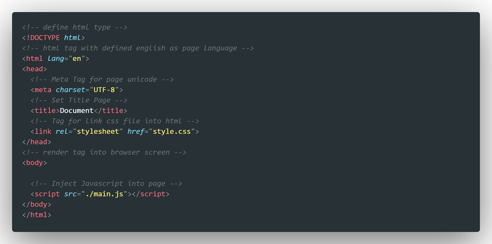
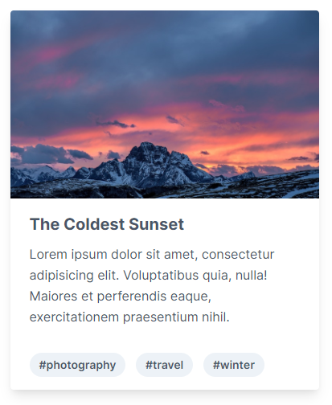

## HTML
Hyper Text Markup Language)

--

Hypertext Markup Language (HTML) is the standard markup language for documents designed to be displayed in a web browser.

*~ Wikipedia*

--

### Highlights

1. Basic HTML
2. Writing Semantic HTML
3. Form
4. Exercise

--

### 1. Basic

--



HTML


--


HTML Anatomy

--


HTML Attribute

--

Read more about HTML tags : [Click Here](https://www.w3schools.com/tags/ref_byfunc.asp)

--

### 2. Writing Semantic HTML

To write semantic HTML is to give it meaning, rather than just describing how it should look in the browser.

--

```html
<div class="heading">My Heading</div>
<div class="paragraph">Here's a sentence I wrote just for you.</div>
```
from this

--

```html
<h1>My Heading</h1>
<p>Here's a sentence I wrote just for you.</p>
```
to this

--

#### Advantages
- Default style
- Communication to other Developers
- SEO
- Screen readers

--

### 3. Form

--


--

```html
<div>
  <form>
    <div>
      <label for="username">
        Username
      </label>
      <input id="username" type="text" placeholder="Username">
    </div>
    <div>
      <label for="password">
        Password
      </label>
      <input id="password" type="password" placeholder="******************">
      <p>Please choose a password.</p>
    </div>
    <div>
      <button type="button">
        Sign In
      </button>
      <a href="#">
        Forgot Password?
      </a>
    </div>
	</form>
</div>
```

--

### 4. Exercise

--



HTML Card Example

--

```html
<div>
  
  <div>
    <div>The Coldest Sunset</div>
    <p>
      Lorem ipsum dolor sit amet, consectetur adipisicing elit. Voluptatibus quia, nulla! Maiores et perferendis eaque, exercitationem praesentium nihil.
    </p>
  </div>
  <div>
    <span>#photography</span>
    <span>#travel</span>
    <span>#winter</span>
  </div>
</div>
```
