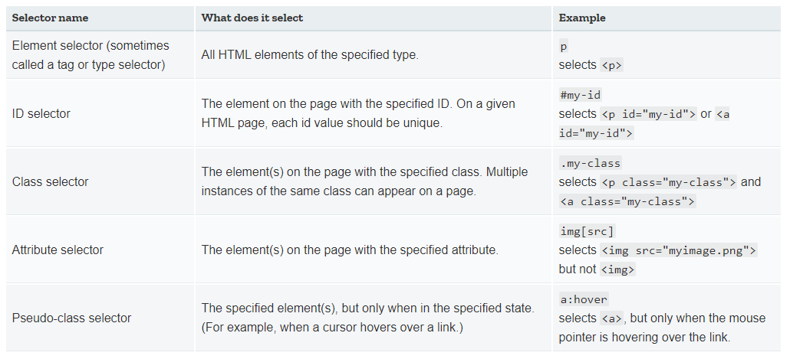

## CSS
(Cascading Style Sheet)

--

CSS comes through and specifies your document's style-page layouts, colors, and fonts are all determined with CSS.

*~https://skillcrush.com/blog/css/*

--

### Highlights

1. Basic CSS
2. Layouting
3. Responsive
4. Transition
5. Animation
6. Pseudo CSS (Elements + Classes)

--

### 1. Basic CSS

--

#### Type of CSS

1. Inline CSS
2. Internal CSS
3. External CSS

--


CSS Anatomy

--



--

### 2. Layouting

1. Floats
2. Positioning
3. Display
4. Box Model
5. Flexbox
6. CSS Grid

--

#### 1. Floats

--

#### 2. Positioning

--

#### 3. Display

--

#### 4. Box Model

--

#### 5. Flexbox

--

#### 6. CSS Grid

--

### 3. Responsive

--

#### Media Query
<br />

```html
<meta name="viewport" content="width=device-width, initial-scale=1.0" />
```
HTML

```css
@media (rule) {}

```
CSS

--

### 4. Transition

--

### 5. Animation

--

### 6. Pseudo CSS (Elements + Classes)

--
